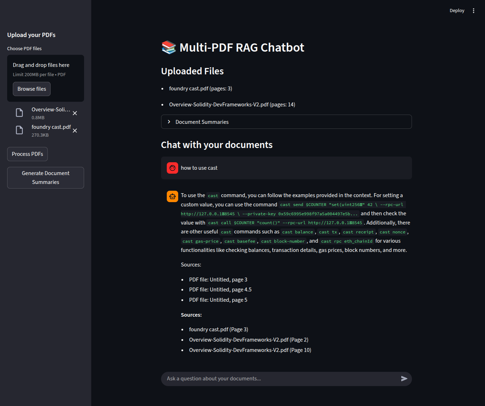

# Multi-PDF RAG Chatbot

A Retrieval-Augmented Generation (RAG) system that allows users to chat with multiple PDF documents simultaneously.



## Features

- ✅ Upload and process multiple PDF documents
- ✅ Smart text chunking with metadata
- ✅ Vector search across all documents
- ✅ Context-aware responses based on document content
- ✅ Source citations for answers
- ✅ Streaming chat interface with real-time responses
- ✅ Document summarization feature
- ✅ Page-level source attribution

## Tech Stack

- Python
- LangChain
- OpenAI API / Hugging Face Models
- Streamlit (frontend)
- ChromaDB (vector storage)
- Sentence Transformers (embeddings)
- PyPDF (PDF processing)

## Setup

1. Clone the repository
2. Install dependencies:
```bash
pip install -r requirements.txt
```
3. Set up your OpenAI API key (optional, if using OpenAI models):
```bash
# Create a .env file and add your OpenAI API key
echo "OPENAI_API_KEY=your_key_here" > .env
```

## Usage

```bash
streamlit run app.py
```

Then:
1. Upload one or more PDF files using the sidebar
2. Click "Process PDFs" to index the documents
3. Use "Generate Document Summaries" to get summaries of your documents
4. Ask questions in the chat interface about your documents
5. View responses with source citations
6. Get query suggestions for follow-up questions

## Architecture

The application follows a modular architecture:
- **Document Processing**: PDF ingestion and text extraction with metadata
- **Text Splitting**: Smart chunking with metadata preservation
- **Vector Storage**: ChromaDB for efficient similarity search
- **Retrieval**: RAG pipeline for context-aware responses
- **UI**: Streamlit interface with streaming responses and source citations
- **Additional Features**: Document summarization and query suggestions